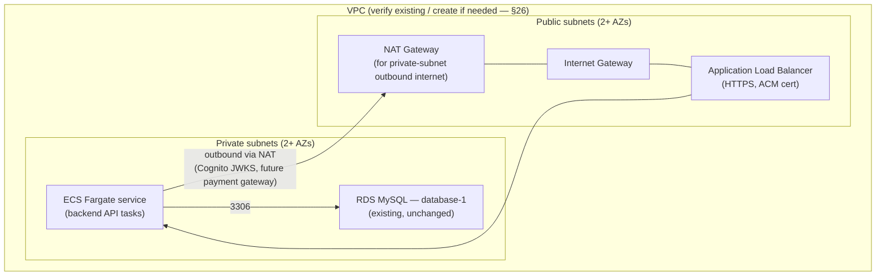

# Phase 2 — AWS Architecture
## Handyman Services Marketplace

**Status:** Design only. No AWS resource is created or modified by this document. Every diagram/table below marks existing resources as existing and proposed resources as proposed; nothing here authorizes their creation — that happens only after the client approves the Phase 2 checklist and Phase 3 begins.

**Builds on:** `PHASE_1_BACKEND_REQUIREMENTS_ANALYSIS.md` §C.22–23, §C.29, §C.34 (the same conclusions, now made concrete enough for Phase 3 to build from) and `PHASE_2_BACKEND_SYSTEM_ARCHITECTURE.md` §2 (the ECS Fargate compute recommendation this network design assumes).

---

## 3. AWS network architecture



**Design:**

- **VPC**: RDS already exists inside *some* VPC (provisioned implicitly when the instance was created). **Whether that VPC's subnet layout is already suitable for adding backend compute alongside it, or a new VPC/subnet design is needed, has not been verified** — this is a read-only check (inspecting existing VPC/subnet/route-table configuration via the AWS console or CLI), explicitly not a resource change, and is listed as a Phase 2→3 prerequisite (§ Implementation Plan doc) rather than assumed either way here.
- **Public subnets**: host only the ALB (and, if used, a NAT Gateway) — the only AWS-side component that should ever be reachable from the public internet, other than Cognito's own AWS-managed public endpoint and the S3/CloudFront media path.
- **Private subnets**: host the backend compute (ECS Fargate tasks, per `PHASE_2_BACKEND_SYSTEM_ARCHITECTURE.md` §2) and RDS. Neither is ever assigned a public IP or made directly reachable from the internet.
- **RDS subnet placement**: unchanged — RDS's "public accessibility: disabled" setting is correct today and must remain so; this design does not touch it.
- **Backend subnet placement**: private subnets, in the same VPC as RDS (or a peered VPC, if RDS turns out to live in a VPC that can't simply be extended — to be determined by the verification step above).
- **ALB placement**: public subnets, since it's the internet-facing entry point; it forwards only to the backend's private-subnet target group.
- **NAT requirement**: the backend needs outbound internet access for calls Cognito's JWKS endpoint (public) and, later, a payment gateway's API — both are external HTTPS endpoints reached from a private subnet, which requires either a NAT Gateway or NAT instance. A NAT Gateway is the standard, lower-operational-burden choice (at a real hourly + per-GB cost, flagged in Phase 1 §C.37 and restated here).
- **Internet Gateway**: standard requirement for the public subnets' own internet reachability (already implicit if the existing VPC has any public-facing resource).
- **Route tables**: public subnets route `0.0.0.0/0` to the Internet Gateway; private subnets route `0.0.0.0/0` to the NAT Gateway (for the outbound calls above) and route intra-VPC traffic directly — standard AWS VPC pattern, not a novel design choice.

**Not created or modified in this phase.**

---

## Security groups (§23 of the original numbering)

**Target end-state relationship** (documented now; not applied now):

```
Internet
   │ 443
   ▼
[ALB Security Group] — inbound 443 from 0.0.0.0/0, outbound to Backend SG only
   │
   ▼
[Backend Security Group] — inbound from ALB SG only (on the API's port), outbound 3306 to RDS SG + 443 to 0.0.0.0/0 (for Cognito/payment calls via NAT)
   │
   ▼
[RDS Security Group] — inbound 3306 from Backend SG ONLY, no CIDR/IP-based rule, no 0.0.0.0/0
```

**Today's actual rule** — RDS inbound restricted to the operator's current IP (`/32`) — is explicitly a temporary development convenience, not a production design, and **must not be read as final** (restated verbatim from Phase 1, since the brief repeats this instruction). The correct end state references security groups **by ID**, not by IP/CIDR, so that scaling the backend (more ECS tasks) never requires an RDS security-group edit — new tasks automatically inherit the Backend Security Group's membership. A developer's `/32` rule may be kept alongside this for local debugging convenience, but should not remain the *only* or primary access path once the backend is deployed; a bastion host or VPN-based access pattern is the recommended longer-term replacement for ad hoc developer access, not designed further here since no specific requirement calls for it yet.

**No security group is created or changed in this phase.**

---

## 15. S3 architecture

| Concern | Design |
|---|---|
| **Bucket purpose** | Existing bucket, unchanged — images/videos/media for the catalog (`service_images`) and, if confirmed in scope, other media-bearing content entities (homepage banners, etc.) |
| **Key/prefix strategy** | `services/{serviceId}/{uuid}.{ext}` for service images (mirrors the existing `ServiceImage` 1-service-to-many-images relationship); a separate top-level prefix per environment (`dev/`, `staging/`, `prod/` — or per-bucket, per `PHASE_2_BACKEND_SYSTEM_ARCHITECTURE.md` §24) so environments never collide |
| **Image storage** | JPEG/PNG/WebP, via the pre-signed-upload flow below |
| **Video storage** | MP4 (or whatever the existing `VideoCuration.videoUrl` convention implies), same flow, larger size ceiling |
| **Allowed file types** | An explicit MIME allow-list enforced by the backend before issuing a pre-signed URL (exact list a Phase 3 detail, not fixed here — e.g. `image/jpeg`, `image/png`, `image/webp`, `video/mp4`) |
| **File size validation** | A maximum size per file type (e.g. a few MB for images, larger for video), enforced both by the backend (rejecting the upload-URL request) and, where the mechanism supports it, by an S3 bucket policy condition on the pre-signed request itself |
| **Metadata** | Stored in MySQL (`service_images.url`, `.alt`, `.sortOrder`), never in S3 object metadata as the source of truth — S3 holds only the bytes |
| **Ownership** | An uploaded image is associated with the `service_id` it belongs to; a Provider may only attach/replace/delete images on their own listing (`created_by_user_id` check, §17), enforced by the backend before issuing the pre-signed URL or accepting the metadata-attach call |
| **Upload authorization** | The backend brokers every upload — no AWS credential or bucket policy is ever given directly to the browser; see the pre-signed flow below |
| **Pre-signed upload** | `POST /media/upload-url` (API contract doc) → backend validates role/ownership/MIME/size → returns a short-lived pre-signed S3 `PUT` URL scoped to one key → browser uploads directly to S3 → browser calls `POST /media/:serviceId/images` to record the resulting key in MySQL. Large media never transits the backend server itself |
| **Deletion** | `DELETE /media/images/:id` removes the MySQL row; whether the S3 object is deleted synchronously or via a later cleanup job is a Phase 3 implementation detail, not fixed here |
| **Replacement** | Modeled as delete + new upload, not an in-place overwrite — keeps the `service_images` row history/ordering simple and avoids any CDN cache-invalidation subtlety of overwriting a still-cached key |
| **Public delivery** | `RECOMMENDED`: public-read objects behind CloudFront (cost/performance win for a catalog whose images are meant to be publicly viewable; no confirmed requirement for restricted/signed delivery) — `TBD / CLIENT CONFIRMATION REQUIRED` if the client instead wants access-restricted media |
| **CloudFront** | Proposed, not created (§26) — fronts the existing bucket for caching and to avoid exposing the raw bucket URL/structure |

**No S3 configuration is changed in this phase** — the bucket policy, prefix structure, and CloudFront distribution above are proposals for Phase 3, per the explicit "do not modify S3" instruction.

---

## 20. Secrets & environment variables

| Variable | Where | Secret? | Notes |
|---|---|---|---|
| `DB_HOST`, `DB_PORT`, `DB_NAME` | Backend | No (not sensitive alone) | |
| `DB_USER`, `DB_PASSWORD` | Backend | **Yes** | Stored as a Secrets Manager (or SSM `SecureString`) reference, injected into the compute environment at runtime — never a literal in source control or a plain task-definition environment variable |
| `COGNITO_USER_POOL_ID` | Backend | No | Identifies the pool, not a credential |
| `COGNITO_REGION` | Backend | No | |
| `COGNITO_APP_CLIENT_ID` (Customer + Admin/Provider clients) | Backend & Frontend | No | Public client IDs are not secrets by Cognito's own design |
| `COGNITO_APP_CLIENT_SECRET` | Backend only | **Yes** | Only applicable if a confidential app client is used; never sent to the frontend |
| `S3_BUCKET_NAME`, `S3_REGION` | Backend | No | |
| `AWS_REGION` | Backend | No | |
| Future payment gateway keys | Backend only | **Yes**, and **`TBD / CLIENT CONFIRMATION REQUIRED`** | No value exists yet — placeholder only |
| `NEXT_PUBLIC_API_BASE_URL` | Frontend (Vercel) | No | e.g. `https://api.handymanservices.in/api/v1` |
| `NEXT_PUBLIC_COGNITO_APP_CLIENT_ID` | Frontend | No | The Customer-facing app client ID |
| `NEXT_PUBLIC_COGNITO_REGION` | Frontend | No | |

**Hard rule, unchanged from Phase 1:** nothing marked "Yes" above is ever present in a `NEXT_PUBLIC_*` variable, in the frontend's build output, or in any client-visible response. The backend's compute role reads secrets from Secrets Manager/Parameter Store at runtime via its IAM role — never from a literal environment variable checked into source control.

---

## 23. DNS & TLS

```
handymanservices.in  ──────────────▶  Vercel (existing, unchanged)
www.handymanservices.in  ──────────▶  Vercel (existing, unchanged)
api.handymanservices.in  ──────────▶  AWS ALB (new CNAME record, GoDaddy)
```

- **`handymanservices.in` / `www`**: unchanged — stays exactly as Vercel's own setup already has it configured; this phase does not touch it.
- **`api.handymanservices.in`**: a new DNS record is needed, pointing at whichever AWS front door fronts the backend (the ALB's DNS name, via a `CNAME` record created in GoDaddy). **Recommended (`RECOMMENDED`)**: keep DNS management entirely in GoDaddy with a simple `CNAME` to the ALB, rather than delegating the zone to Route 53 — lower operational overhead for the one subdomain currently needed. Delegating to Route 53 remains an option if more AWS-hosted subdomains are anticipated later, but nothing in the confirmed scope currently justifies that added complexity.
- **TLS**: an AWS Certificate Manager (ACM) certificate for `api.handymanservices.in`, attached to the ALB, handles HTTPS termination at the AWS edge — validated via a DNS `CNAME` record GoDaddy would also need to add once the certificate request is created (standard ACM DNS-validation flow).
- **Not changed in this phase**: no DNS record is created or modified; this section documents the target configuration for Phase 3.

---

## 26. AWS resource plan

| Resource | Purpose | Existing / New | Phase | Dependency | Cost consideration | Security consideration |
|---|---|---|---|---|---|---|
| Amazon Cognito User Pool | Auth for all 3 roles | **Existing** | — | — | Free tier likely covers current scale | Group/app-client config needed (§4, Authorization Matrix doc) — not a new resource |
| RDS MySQL `database-1` | Database of record | **Existing** | — | — | `db.t4g.micro` adequate for now; scaling path in Phase 1 §C.21 | Must stay private; security-group target state above |
| S3 bucket | Media storage | **Existing** | — | — | Minimal at current likely volume | Bucket policy/prefix strategy to finalize (§15) |
| VPC / subnets | Network boundary for backend + RDS | **Verify existing / create if needed** | Phase 3 (verification first) | RDS's existing VPC | — | Private subnets for RDS + backend, mandatory |
| ECS Fargate cluster/service | Backend compute | **New** | Phase 3 | VPC, ECR image | Always-on cost proportional to reserved CPU/memory (§2, System Architecture doc) | Least-privilege IAM task role |
| Application Load Balancer | Public entry point for backend | **New** | Phase 3 | Public subnets, ACM cert | Hourly + LCU cost, modest at this scale | HTTPS only; forwards only to backend SG |
| NAT Gateway | Outbound internet for private-subnet backend | **New** | Phase 3 | VPC | Hourly + per-GB — easy to underestimate (Phase 1 §C.37) | Only path for backend's outbound calls |
| ACM certificate | TLS for `api.handymanservices.in` | **New** | Phase 3 | DNS validation record in GoDaddy | Free | Standard AWS-managed renewal |
| CloudFront distribution | CDN in front of S3 media | **New (proposed)** | Phase 3 | Existing S3 bucket | Small added cost, likely net-reduces S3 request costs | Public-read vs. signed URLs — §15 |
| Secrets Manager (or SSM Parameter Store) | DB/Cognito/future payment secrets | **New** | Phase 3 | — | Small per-secret monthly fee (Secrets Manager) or free (Parameter Store standard) | Least-privilege IAM read access |
| CloudWatch (log groups, metrics, alarms) | Observability | **New (log groups created implicitly by compute; alarms/dashboards later)** | Phase 3 | Backend compute, RDS | Usage-based, modest at this scale | No sensitive data in log lines (§19) |
| GoDaddy DNS record (`api.handymanservices.in`) | Route traffic to the backend | **New** | Phase 3 | ALB DNS name | Free (GoDaddy DNS management) | — |
| IAM roles/policies (backend task role, etc.) | Scoped permissions for compute | **New** | Phase 3 | — | Free | Least-privilege, not broad account access |

**Already created:** Cognito, RDS, S3 (top three rows). **Everything else is proposed for Phase 3 and is not created by this document.**

---

**Cross-reference:** compute choice rationale is in `PHASE_2_BACKEND_SYSTEM_ARCHITECTURE.md` §2. Logging/monitoring detail (what CloudWatch tracks) is in that same document §21. Database-level security (RDS schema, query patterns) is in `PHASE_2_BACKEND_DATABASE_SCHEMA.md`. Role/JWT verification detail is in `PHASE_2_AUTHORIZATION_MATRIX.md`.

**No AWS resource is created or modified by this document.**
