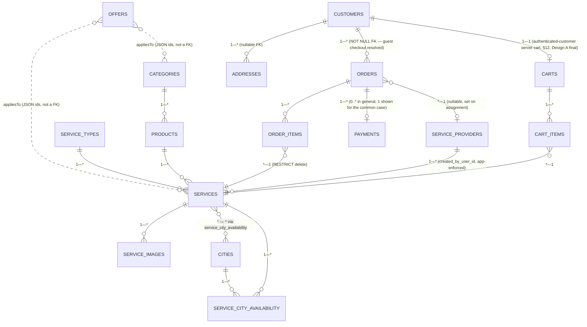
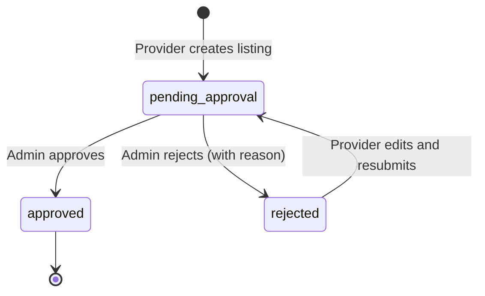
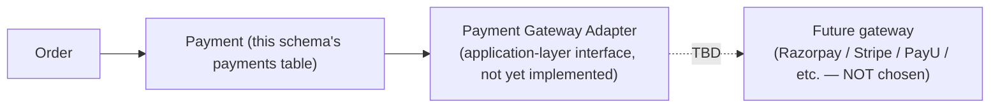

# Phase 2 — Backend Database Schema
## Handyman Services Marketplace

**Status:** Design only. No table has been created, no migration has been written or run, and the existing RDS instance (`database-1`) has not been connected to or modified. This is a schema **design** for Phase 3 to implement.

**Builds on:** the already-approved `PHASE_2_DATA_ARCHITECTURE.md` and `src/types/index.ts` — this document does **not** throw away that model. Every entity already approved there is carried forward; this document adds the columns, keys, and the auth/ownership/approval fields a real, multi-role backend needs that a mock/no-auth frontend never had to have.

**Engine:** MySQL 8.x (matching the existing RDS engine family), InnoDB storage engine throughout (required for foreign keys and transactional integrity).

**ID strategy (applies to every table below unless noted):** primary keys are **UUID v4, stored as `CHAR(36)`**, generated application-side (or via `UUID()` at insert time) rather than an auto-increment integer. Rationale: the existing mock data already uses string IDs throughout `src/types/index.ts` (`id: string`), so this preserves frontend type compatibility with zero remapping; UUIDs also avoid leaking a sequential record count (e.g. "how many orders exist") through an API response, and avoid ID collisions across environments (dev/staging/prod data can be merged or copied without ID clashes). The one recommended exception is high-volume, purely internal join/audit rows where an auto-increment `BIGINT UNSIGNED` is acceptable since they are never exposed through the API — flagged per-table below where relevant. Money is **never** stored as `FLOAT`/`DOUBLE` — see §7 money-precision rule.

---

## 6. Database design — entity classification

| Entity | Status | Notes |
|---|---|---|
| `cities` | **Confirmed** | Direct port of `City` |
| `categories` | **Confirmed** | Direct port of `Category` |
| `products` | **Confirmed** | Direct port of `Product` |
| `service_types` | **Confirmed** | Direct port of `ServiceType` |
| `services` | **Confirmed**, extended | Core `Service` port + approval/ownership fields (new, required for the real multi-role workflow) |
| `service_city_availability` | **Confirmed** | Direct port of `ServiceCityAvailability` |
| `service_images` | **Confirmed** | Direct port of `ServiceImage` |
| `offers` | **Confirmed, extended by PHASE 3 CORRECTION** | Direct port of `Offer` + `applicability_type`/`city_id`/`seq` (ALL_INDIA vs. CITY, with deterministic priority — §10 resolved) |
| `customers` | **Confirmed, new table** | `Customer` existed only as a TBD-auth type; now needs real columns since Cognito auth is confirmed |
| `service_providers` | **Confirmed, new table** | Same treatment as `customers` |
| `addresses` | **Confirmed** | Direct port of `Address` |
| `carts` / `cart_items` | **RESOLVED, Confirmed — Design A (hybrid)** — see §12 | Guest checkout decision is final: anonymous browsing/add-to-cart stays client-local (no `carts`/`cart_items` rows); the server-persisted `carts`/`cart_items` tables exist only for an authenticated customer. Design B (login-required cart) is superseded and not built. |
| `orders` / `order_items` | **Confirmed** | Direct port of `Order`/`OrderItem`, with snapshot fields (§10); `customer_id` is `NOT NULL` (guest checkout decision resolved — see §7, §13) |
| `payments` | **Confirmed shape, TBD gateway** | Boundary/abstraction table (§14) — no gateway-specific columns until a provider is chosen |
| `testimonials`, `faqs`, `contact_info`, `homepage_sections`, `nav_items` | **RESOLVED, Confirmed — in scope** | Admin content-management scope is final: Admin manages all business/content fields, including these. Implemented in Phase 3 (`PHASE_3_BACKEND_IMPLEMENTATION.md` §12). |
| `plans` | **Legacy** | Retained as-is, unchanged from `Plan`, per the client's existing "legacy, pending decision" instruction |
| `reviews` | **Not in scope** | Not created — Open Question #10 (reviews in scope at all?) is unresolved; creating this table now would be building for an unconfirmed feature, which the brief explicitly forbids |
| `coupons` | **Not in scope** | Not created — distinct from `offers` per the existing data-architecture note; Open Question #4 |
| `wallet` | **Not in scope** | Not created — Open Question #5 |
| `provider_order_tracking` / notifications tables | **Not in scope** | Not created — Open Questions #7–9 (assignment logic, live tracking, notifications) all unresolved |

---

## 7. Database columns

Money columns use `DECIMAL(10,2)` (up to 99,999,999.99 — far beyond any realistic service price, with exact decimal precision — never `FLOAT`/`DOUBLE`, which introduce rounding error unacceptable for currency). All `id` columns are `CHAR(36)` UUIDs unless noted. All tables include `created_at DATETIME NOT NULL DEFAULT CURRENT_TIMESTAMP` and `updated_at DATETIME NOT NULL DEFAULT CURRENT_TIMESTAMP ON UPDATE CURRENT_TIMESTAMP` (omitted from the per-column tables below to avoid repeating them 25 times — present on every table).

### `cities`

| Column | Type | Null | Key | Notes |
|---|---|---|---|---|
| `id` | CHAR(36) | NO | PK | |
| `name` | VARCHAR(100) | NO | | |
| `state` | VARCHAR(100) | NO | | |
| `slug` | VARCHAR(120) | NO | UNIQUE | URL-safe identifier |
| `is_popular` | BOOLEAN | NO | | default `false` |
| `active` | BOOLEAN | NO | INDEX | default `true`; indexed — every catalog query filters on it |
| `sort_order` | INT | NO | | |
| `icon_url` | VARCHAR(500) | YES | | S3/CloudFront URL, nullable = no icon uploaded (matches existing `City.iconUrl` semantics) |
| `icon_alt` | VARCHAR(255) | YES | | |

### `categories`

| Column | Type | Null | Key | Notes |
|---|---|---|---|---|
| `id` | CHAR(36) | NO | PK | |
| `slug` | VARCHAR(120) | NO | UNIQUE | |
| `name` | VARCHAR(150) | NO | | |
| `description` | TEXT | NO | | |
| `icon` | VARCHAR(100) | NO | | icon key, resolved client-side |
| `image` | VARCHAR(500) | YES | | S3/CloudFront URL |
| `sort_order` | INT | NO | | |
| `active` | BOOLEAN | NO | INDEX | default `true` |

### `products`

| Column | Type | Null | Key | Notes |
|---|---|---|---|---|
| `id` | CHAR(36) | NO | PK | |
| `category_id` | CHAR(36) | NO | FK → `categories.id`, INDEX | `ON DELETE RESTRICT` — a category with products cannot be deleted outright (Admin must reassign/deactivate first) |
| `slug` | VARCHAR(120) | NO | UNIQUE | globally unique per Open Question #23's assumed-default, carried forward |
| `name` | VARCHAR(150) | NO | | |
| `description` | TEXT | NO | | |
| `icon` | VARCHAR(100) | NO | | |
| `image` | VARCHAR(500) | YES | | |
| `sort_order` | INT | NO | | |
| `active` | BOOLEAN | NO | INDEX | |

### `service_types`

| Column | Type | Null | Key | Notes |
|---|---|---|---|---|
| `id` | CHAR(36) | NO | PK | |
| `key` | VARCHAR(50) | NO | UNIQUE | machine key, e.g. `installation` |
| `label` | VARCHAR(100) | NO | | |
| `sort_order` | INT | NO | | |
| `active` | BOOLEAN | NO | | |

### `services` (core entity, extended for real backend)

| Column | Type | Null | Key | Notes |
|---|---|---|---|---|
| `id` | CHAR(36) | NO | PK | |
| `slug` | VARCHAR(160) | NO | UNIQUE | |
| `product_id` | CHAR(36) | NO | FK → `products.id`, INDEX | `ON DELETE RESTRICT` |
| `service_type_id` | CHAR(36) | NO | FK → `service_types.id`, INDEX | `ON DELETE RESTRICT` |
| `name` | VARCHAR(200) | NO | | |
| `short_description` | VARCHAR(500) | NO | | |
| `description` | TEXT | NO | | |
| `whats_included` | JSON | NO | | array of strings — matches `whatsIncluded: string[]`; MySQL 8's native `JSON` type, validated application-side |
| `mrp` | DECIMAL(10,2) | NO | | source of truth, never negative (`CHECK (mrp >= 0)`) |
| `offer_price` | DECIMAL(10,2) | NO | | source of truth; `discount_percent`/`discount_amount` are **not stored** — derived at read time (§10) |
| `rating_average` | DECIMAL(2,1) | YES | | nullable = no rating set, never a fabricated `0` |
| `rating_count` | INT | NO | | default `0` |
| `is_most_booked` | BOOLEAN | NO | | Admin-curated flag, not computed (per the existing, client-approved design) |
| `featured` | BOOLEAN | NO | | |
| `active` | BOOLEAN | NO | INDEX | Admin can deactivate independent of approval status |
| `sort_order` | INT | NO | | |
| `approval_status` | ENUM('pending_approval','approved','rejected') | NO | INDEX | **new** — §9 |
| `rejection_reason` | VARCHAR(1000) | YES | | **new** — set only when `approval_status = 'rejected'` |
| `approved_by_user_id` | CHAR(36) | YES | FK → `customers.id` / admin identity (see §9 note on admin identity table) | **new** |
| `approved_at` | DATETIME | YES | | **new** |
| `created_by_role` | ENUM('admin','provider') | NO | | **new** |
| `created_by_user_id` | CHAR(36) | NO | INDEX | **new** — FK is polymorphic (an admin user ID or a `service_providers.id`); enforced at the application layer rather than a single DB foreign key, since it references one of two tables depending on `created_by_role` — see §9 |

`availableCityIds` (the frontend's derived convenience field) is **not a column** — it is computed at read time by joining `service_city_availability`, exactly as today's mock `hydrate()` function already does (`availableCityIdsFor()` in `src/lib/data/services.ts`). `discount_percent`/`discount_amount` are likewise never stored (§10).

### `service_city_availability`

| Column | Type | Null | Key | Notes |
|---|---|---|---|---|
| `id` | CHAR(36) | NO | PK | |
| `service_id` | CHAR(36) | NO | FK → `services.id` `ON DELETE CASCADE`, part of composite UNIQUE | |
| `city_id` | CHAR(36) | NO | FK → `cities.id` `ON DELETE CASCADE`, part of composite UNIQUE | |
| `active` | BOOLEAN | NO | | pause without deleting the relationship |
| | | | UNIQUE (`service_id`, `city_id`) | prevents a duplicate availability row for the same pair |

### `service_images`

| Column | Type | Null | Key | Notes |
|---|---|---|---|---|
| `id` | CHAR(36) | NO | PK | |
| `service_id` | CHAR(36) | NO | FK → `services.id` `ON DELETE CASCADE`, INDEX | |
| `url` | VARCHAR(500) | NO | | S3/CloudFront URL/key only — **never binary data** |
| `alt` | VARCHAR(255) | NO | | |
| `sort_order` | INT | NO | | |

### `offers`

**PHASE 3 CORRECTION (supersedes the original row set below where noted):** an Offer is either `ALL_INDIA` (nationwide, `city_id` NULL) or `CITY` (exactly one named city, `city_id` required) — never both, never neither, enforced by a `CHECK` constraint. The original design below had no city concept on `offers` at all; this is purely additive (see `backend/src/database/migrations/20260101000012_add_offer_applicability.ts`).

| Column | Type | Null | Key | Notes |
|---|---|---|---|---|
| `id` | CHAR(36) | NO | PK | |
| `title` | VARCHAR(150) | NO | | |
| `description` | TEXT | NO | | |
| `discount_type` | ENUM('percent','flat') | NO | | |
| `discount_value` | DECIMAL(10,2) | NO | | |
| `applies_to_scope` | ENUM('all','category','service') | NO | | flattened from `appliesTo: {scope, ids}` |
| `applies_to_ids` | JSON | NO | | array of category/service IDs; empty array when scope = `all` |
| `applicability_type` | ENUM('all_india','city') | NO | INDEX (with `city_id`) | **Added by the correction.** Defaults `all_india` for every pre-correction row — the only reading consistent with a schema that never had a city column. |
| `city_id` | CHAR(36) | YES | FK → `cities.id` `ON DELETE RESTRICT`, INDEX (with `applicability_type`) | **Added by the correction.** NULL when `applicability_type = 'all_india'`, required when `'city'` — enforced by `CHECK (applicability_type = 'all_india' AND city_id IS NULL) OR (applicability_type = 'city' AND city_id IS NOT NULL)`. |
| `seq` | INT UNSIGNED | NO | UNIQUE, AUTO_INCREMENT | **Added by the correction.** Plain insertion-order counter used only to deterministically resolve which of several ambiguously-matching Offers is "most recently created" when more than one matches the same applicability tier for the same service/city — `created_at` alone is second-precision and can tie. |
| `banner_image` | VARCHAR(500) | YES | | |
| `start_date` | DATE | YES | | |
| `end_date` | DATE | YES | | |
| `active` | BOOLEAN | NO | INDEX | |

### `customers` (new — real columns now that Cognito auth is confirmed)

| Column | Type | Null | Key | Notes |
|---|---|---|---|---|
| `id` | CHAR(36) | NO | PK | |
| `cognito_sub` | VARCHAR(100) | NO | UNIQUE | Cognito's stable user identifier — the JWT `sub` claim; this is what every authenticated request is matched against |
| `name` | VARCHAR(150) | NO | | |
| `phone` | VARCHAR(20) | YES | | nullable — final sign-in method is email+password (§4, Authorization Matrix doc, resolved); phone is not collected at registration |
| `email` | VARCHAR(255) | YES | UNIQUE (nullable-safe) | nullable for the symmetric reason (phone-only sign-up) |
| `account_status` | ENUM('active','disabled') | NO | | mirrors Cognito's own enable/disable state so the backend can locally short-circuit a disabled account without an extra Cognito call on every request; source of truth for enablement is still Cognito (§4) |

### `service_providers` (new — same treatment)

| Column | Type | Null | Key | Notes |
|---|---|---|---|---|
| `id` | CHAR(36) | NO | PK | |
| `cognito_sub` | VARCHAR(100) | NO | UNIQUE | |
| `name` | VARCHAR(150) | NO | | |
| `phone` | VARCHAR(20) | YES | | |
| `account_status` | ENUM('active','disabled') | NO | | |

*(`assigned_order_ids` from the existing `ServiceProvider` type is deliberately **not** a stored array column — it is the inverse of `orders.provider_id`, computed by querying `orders WHERE provider_id = ?`, consistent with normal relational design and avoiding a denormalized, easily-stale list.)*

**Admin identity note:** this schema does not introduce a separate `admins` table. An Admin's identity is the Cognito `sub` claim plus the `admin` group/role membership (§4, Authorization Matrix doc) — there is no Admin-specific business data (no "Admin profile") the existing frontend or Phase 1 requirements ask for beyond "the company owner/operator," so a dedicated table would be schema for a feature that doesn't exist yet. If a future confirmed requirement needs Admin-specific stored data (e.g. a display name separate from Cognito's), a minimal `admins` table can be added without disturbing this design. `services.approved_by_user_id` in that case stores the Cognito `sub` of the approving Admin directly (`VARCHAR(100)`, not a foreign key to a table that doesn't exist) — noted as a design decision to revisit if an `admins` table is later added.

### `addresses`

| Column | Type | Null | Key | Notes |
|---|---|---|---|---|
| `id` | CHAR(36) | NO | PK | |
| `customer_id` | CHAR(36) | YES | FK → `customers.id` `ON DELETE CASCADE`, INDEX | nullable — a guest-checkout address has no saved customer, per the existing type's own documented nullability |
| `label` | VARCHAR(50) | NO | | e.g. "Home", "Office" |
| `line1` | VARCHAR(255) | NO | | |
| `line2` | VARCHAR(255) | YES | | |
| `city` | VARCHAR(100) | NO | | free-text city name as entered, distinct from the `cities` catalog table — matches the existing `Address.city: string` shape (not a FK to `cities.id`; an address's city name and the serviceable-city catalog are not the same concept in the current data architecture) |
| `state` | VARCHAR(100) | NO | | |
| `pincode` | VARCHAR(10) | NO | | |
| `is_default` | BOOLEAN | NO | | |

### `carts` / `cart_items` — see §12 for the two candidate designs and which columns apply to each.

### `orders`

| Column | Type | Null | Key | Notes |
|---|---|---|---|---|
| `id` | CHAR(36) | NO | PK | |
| `order_number` | VARCHAR(30) | NO | UNIQUE | human-readable, e.g. `ORD-20260930-XXXXX` — separate from the internal UUID `id`, for customer-facing display/support reference (an addition over the mock's `ORD-<timestamp>` id, kept as its own column so the UUID PK and the display number can evolve independently) |
| `customer_id` | CHAR(36) | NO | FK → `customers.id` `ON DELETE RESTRICT`, INDEX | **RESOLVED**: guest checkout is not allowed — order placement requires an authenticated customer, so this column is `NOT NULL`. Implemented in Phase 3 (`create_orders_and_order_items` migration; `orders.customer_id NOT NULL` is structurally enforced, with no code path that can insert an order without one). |
| `address_line1`, `address_line2`, `address_city`, `address_state`, `address_pincode`, `address_label` | VARCHAR | NO / YES per field | | **snapshot columns**, not a FK to `addresses` — a later address edit must never rewrite order history (§10) |
| `scheduled_date` | DATE | NO | | |
| `scheduled_slot` | VARCHAR(50) | YES | | simple preference string (e.g. "morning"), per the existing default assumption pending Open Question re: slot rules — not a real time-window system |
| `subtotal` | DECIMAL(10,2) | NO | | |
| `discount_total` | DECIMAL(10,2) | NO | | |
| `total` | DECIMAL(10,2) | NO | | |
| `status` | ENUM('pending','confirmed','assigned','in_progress','completed','cancelled') | NO | INDEX | open lookup, matches existing `OrderStatus` exactly |
| `provider_id` | CHAR(36) | YES | FK → `service_providers.id` `ON DELETE SET NULL`, INDEX | set once assigned — assignment logic itself is TBD (Open Question #7), not designed here |
| `payment_status` | VARCHAR(30) | NO | | open string, not yet an enum, since the gateway/status vocabulary is TBD (§14) — default `'not_applicable'` until a gateway exists |

### `order_items`

**PHASE 3 CORRECTION:** six columns were added so a historical order snapshots the FULL pricing breakdown, not just the final price (`backend/src/database/migrations/20260101000013_add_order_item_pricing_breakdown.ts`) — see the new rows below. `unit_price`/`line_total` keep their original meaning and names (the final price actually charged).

| Column | Type | Null | Key | Notes |
|---|---|---|---|---|
| `id` | CHAR(36) | NO | PK | |
| `order_id` | CHAR(36) | NO | FK → `orders.id` `ON DELETE CASCADE`, INDEX | |
| `service_id` | CHAR(36) | NO | FK → `services.id` `ON DELETE RESTRICT` | restrict, not cascade — an order item must never be silently deleted by a service being removed; a service should be deactivated, not hard-deleted, once it has ever been ordered (operational rule, not a new column) |
| `service_name_snapshot` | VARCHAR(200) | NO | | **snapshot** — §10 |
| `quantity` | INT | NO | | `CHECK (quantity > 0)` |
| `mrp_snapshot` | DECIMAL(10,2) | NO | | **Added by the correction.** `services.mrp` at order time. |
| `service_offer_price_snapshot` | DECIMAL(10,2) | NO | | **Added by the correction.** `services.offer_price` at order time, BEFORE any Offer discount. |
| `service_discount_amount` | DECIMAL(10,2) | NO | DEFAULT 0 | **Added by the correction.** `mrp_snapshot - service_offer_price_snapshot`. |
| `effective_offer_id` | CHAR(36) | YES | FK → `offers.id` `ON DELETE SET NULL` | **Added by the correction.** The ONE effective Offer applied, if any — the link can be lost if the Offer is later deleted, but the two snapshot columns below never are. |
| `effective_offer_name_snapshot` | VARCHAR(150) | YES | | **Added by the correction.** Survives the Offer being renamed or deleted. |
| `effective_offer_applicability_type_snapshot` | ENUM('all_india','city') | YES | | **Added by the correction.** |
| `offer_discount_amount` | DECIMAL(10,2) | NO | DEFAULT 0 | **Added by the correction.** Capped so it can never exceed `service_offer_price_snapshot` (price floor at 0). |
| `total_discount_amount` | DECIMAL(10,2) | NO | DEFAULT 0 | **Added by the correction.** `service_discount_amount + offer_discount_amount` — the two are now combined, never kept separate (§10, Open Question #25 resolved). |
| `unit_price` | DECIMAL(10,2) | NO | | **snapshot** — the FINAL price actually charged (`service_offer_price_snapshot - offer_discount_amount`), not a live read of `services.offer_price` |
| `line_total` | DECIMAL(10,2) | NO | | `quantity * unit_price`, stored (not purely computed) so a later price change can never alter historical order totals even indirectly |

### `payments` (boundary/abstraction only — §14)

| Column | Type | Null | Key | Notes |
|---|---|---|---|---|
| `id` | CHAR(36) | NO | PK | |
| `order_id` | CHAR(36) | NO | FK → `orders.id` `ON DELETE RESTRICT`, INDEX | |
| `amount` | DECIMAL(10,2) | NO | | |
| `status` | ENUM('initiated','succeeded','failed','refunded') | NO | INDEX | generic, gateway-agnostic lifecycle |
| `provider` | VARCHAR(50) | YES | | gateway name — `NULL` until a gateway is chosen; **`TBD / CLIENT CONFIRMATION REQUIRED`** |
| `provider_reference` | VARCHAR(255) | YES | | the gateway's own transaction/reference ID, opaque to this schema |
| `idempotency_key` | VARCHAR(100) | NO | UNIQUE | see §14/§19 — prevents a client retry from creating a duplicate payment record |

No gateway-specific columns (card details, UPI VPA, wallet reference, etc.) are added — those are explicitly out of scope until the gateway is chosen (§14), and would violate the brief's "do not invent payment providers" rule if speculated on here.

### Content tables (RESOLVED — Admin content-management scope confirmed, Phase 1 §C.41 item 4)

`testimonials`, `faqs`, `contact_info`, `homepage_sections`, `nav_items` — each a direct column-for-column port of its existing `src/types/index.ts` shape (`Testimonial`, `FAQ`, `ContactInfo`, `HomepageSection`, `NavItem`). Not expanded to full column tables here since their shape is already fully specified in the existing type file and needs no redesign. Admin content-management scope is final — Admin CRUD over these (and the broader content/branding set named in `PHASE_2_BACKEND_OPEN_QUESTIONS.md` item 20) is in scope and was built in Phase 3 (`PHASE_3_BACKEND_IMPLEMENTATION.md` §12).

### `plans` (legacy)

Direct, unmodified port of the existing `Plan` type — retained, not rebuilt, not removed, exactly per the client's "LEGACY / PENDING CLIENT DECISION" instruction already on record.

---

## 8. Database relationships / ERD



**Cardinality notes:**

- **Category → Product → Service**: strict one-to-many chains, matching the existing, approved hierarchy exactly — no redesign.
- **Service ↔ City**: many-to-many, expressed through `service_city_availability`, never duplicated `Service` rows per city (this is the existing, explicitly-justified design from `PHASE_2_DATA_ARCHITECTURE.md` §5, carried forward unchanged).
- **Service → ServiceImage**: one-to-many, typically 3–5+ per the existing client requirement.
- **Offer → Service/Category**: deliberately **not** a foreign key — `applies_to_ids` is a JSON array interpreted at read time against whichever scope is set, exactly matching the existing `appliesTo: {scope, ids}` shape. A real FK isn't possible here anyway since the same column means "category IDs" or "service IDs" depending on `scope`.
- **Customer → Address**: one-to-many, nullable FK (guest addresses have no customer).
- **Customer → Order**: one-to-many, `NOT NULL` FK — guest checkout is resolved as disallowed, so every order has an owning customer.
- **Customer → Cart**: one-to-one, exists only for an authenticated customer (Design A, §12, final) — there is no server-side cart row for anonymous browsing.
- **Cart → CartItem → Service**: one-to-many, many-to-one — a cart item always resolves to exactly one service (mirrors the existing `CartItem` shape).
- **Order → OrderItem → Service**: one-to-many, many-to-one, with `ON DELETE RESTRICT` on the service FK specifically so historical order line items can never be orphaned by a service deletion.
- **Order → Payment**: one order can have more than one payment attempt over time (e.g. a failed attempt followed by a successful one), so this is modeled as one-to-many even though the common case is a single successful payment.
- **Order → ServiceProvider**: many-to-one, nullable (unassigned until the TBD assignment logic runs).
- **ServiceProvider → Service**: one-to-many via `services.created_by_user_id` where `created_by_role = 'provider'` — enforced at the application layer (§ `services` table note), not a single database-level FK, because the same column can instead point at an Admin identity when `created_by_role = 'admin'`.

---

## 9. Listing approval design

**State model (chosen: the simpler of the two options in the brief, not the longer draft→pending→approved→active chain):**



**Why the shorter model over the four-state draft/pending/approved/active chain:** a separate `draft` state and a separate `active/published` state beyond `approved` would each require their own transition logic and UI, and nothing in the confirmed requirements describes a Provider saving an incomplete listing before submitting it, or an Admin needing to approve a listing that then sits "approved but not yet published" as a distinct step — the client's own description is exactly "pending approval → Admin approves/rejects → approved is customer-visible." Adding the extra states would be inventing workflow complexity the brief explicitly warns against ("do not invent unnecessary workflow states"). The existing `services.active` boolean already gives Admin a separate, independent lever to pull a listing from customer visibility *after* approval (e.g. temporarily out of stock) without re-running the approval workflow — so "approved but currently hidden" is already expressible via `approval_status = 'approved'` + `active = false`, without a fourth state.

**Customer-facing catalog query rule (enforced at the backend query level, not the frontend):**
```sql
WHERE approval_status = 'approved' AND active = TRUE
```
applied to every public catalog endpoint — never relaxed for any caller without the `admin` or the owning `provider` role.

**Fields** (already specified in §7's `services` table): `approval_status`, `created_by_user_id`, `created_by_role`, `approved_by_user_id`, `approved_at`, `rejection_reason`.

**Resubmission:** a `rejected` listing can transition back to `pending_approval` when its owning Provider edits and resubmits it (clearing `rejection_reason` and `approved_by_user_id`/`approved_at` on that transition) — this satisfies the brief's "rejected providers can understand why their listing was rejected" requirement via the retained `rejection_reason` shown to the Provider, and gives them a path forward rather than a dead end.

**Admin-authored listings (RESOLVED — the Phase 1/2 "publishes immediately" assumption was INCORRECT and is superseded):** the final business rule is that there is no fourth role and no second approver. An Admin-created listing is created `approval_status = 'pending_approval'` — exactly like a Provider-created listing — `created_by_role = 'admin'`, and must pass through the same shared Admin approval queue before it is publicly visible. Admin is intentionally permitted to approve an Admin-created listing from that same queue (`approved_by_user_id` can equal the creating Admin) — this self-approval is a deliberate business rule, not a bug, and no Super Admin / second-approver role exists or should be introduced. Implemented in Phase 3: `createService()` (`src/modules/services/services.service.ts`) is the one function both `POST /provider/listings` and `POST /admin/services` call, and there is no code path that publishes a listing directly (see `PHASE_3_BACKEND_IMPLEMENTATION.md` §9, `approval.test.ts`).

---

## 10. Pricing architecture

**Source of truth:** `services.mrp` and `services.offer_price`, stored as `DECIMAL(10,2)`. Both are set by Admin (or, for a Provider-authored listing, proposed by the Provider and only take visible effect once `approval_status = 'approved'` — pricing on a pending/rejected listing is never customer-facing, since the whole listing isn't).

**Derived fields — never stored:** `discount_percent` and `discount_amount` are computed **at read time**, in the backend, by porting the existing `computeDiscount()` logic in `src/lib/pricing.ts` server-side unchanged (same rounding: `discountAmount = round((mrp - offerPrice) * 100) / 100`, `discountPercent = round((discountAmount / mrp) * 100)`, with the same zero-result guard when `mrp <= 0` or `offerPrice >= mrp`). This preserves the existing, already-correct principle — "editing mrp/offerPrice can never leave a stale discount value" — by construction, since there is no stored discount to go stale.

**Rounding:** currency values round to 2 decimal places (`DECIMAL(10,2)`'s native precision); `discount_percent` rounds to the nearest whole percent, exactly matching the existing `Math.round()` behavior in `lib/pricing.ts` — no change to the existing, already-approved rounding rule.

**Currency:** implicitly INR throughout (matches the existing `formatINR()` frontend helper and the `.in` domain/business context) — not restated as a stored column on every money-bearing table, since multi-currency is not a confirmed requirement; if it ever becomes one, a currency column would need to be added at that time, not speculated on now.

**Offers (PHASE 3 CORRECTION — supersedes this paragraph's original text, quoted below for history):** `offers` remains its own table/entity, but Open Question #25 is now **resolved**: a service's own `mrp`/`offerPrice` discount **does combine** with the one effective Offer. "Effective" means exactly one Offer, never more — an Offer is now either `ALL_INDIA` (nationwide) or `CITY` (exactly one named city, via the new `applicability_type`/`city_id` columns above); when both a matching `ALL_INDIA` and a matching `CITY` offer exist for the same service/city, the `CITY` offer wins and the two are never stacked. The offer discount applies to the service's `offer_price` (never the raw `mrp`), floored so the final price can never go negative. See `PHASE_3_BACKEND_IMPLEMENTATION.md` §8 for the full resolution/combination algorithm and `backend/src/shared/pricing.ts`'s `computeFinalPricing()` for the implementation.
>
> Original (pre-correction) text, kept for history: *"`offers` remains its own table/entity, read and returned alongside a service's derived discount, never automatically combined with it — restated from Phase 1 and `PHASE_2_DATA_ARCHITECTURE.md`: whether an applicable Offer stacks with, replaces, or is independent of `offer_price`'s own discount is `TBD / CLIENT CONFIRMATION REQUIRED` (Open Question #25). The backend must not implement any stacking/combination logic until this is confirmed — a catalog response can include both figures (the service's own discount, and any matching active offer) as separate fields, leaving the combination decision to a future confirmed rule and, in the meantime, to the frontend's existing pattern of showing an offer as a separate informational element."*

**Future coupon support boundary:** not designed beyond noting that `coupons`, if ever confirmed (Open Question #4), would be its own table and its own application-time discount step at checkout — distinct from both `offers` and `services.offer_price` — consistent with the existing data architecture's own note that coupons are explicitly not folded into `Offer`. No coupon table or logic exists in this schema.

**Order-time price snapshotting (critical, explicitly required by the brief):** `order_items.unit_price` and `order_items.service_name_snapshot` are captured **at order-creation time** from the service's then-current `offer_price`/`name`, and never re-read from `services` afterward. `orders.subtotal`/`discount_total`/`total` are likewise computed once, at creation, from those snapshotted line items, and stored — not recomputed on every read. This guarantees, by construction, that **an Admin changing a service's price after an order was placed cannot alter that order's historical total** — the exact requirement the brief calls out. This is a direct continuation of the existing mock `createOrder()`'s own behavior (`src/lib/data/orders.ts` already snapshots `unitPrice`/`lineTotal` at creation time, and the frontend's `CartItem.unitPriceAtAdd` already snapshots price at add-to-cart time for the same reason) — the real backend does not introduce a new pattern here, it formalizes an existing, already-correct one.

---

## 11. City & availability

Already covered structurally in §6–8 (`service_city_availability` as a join table, not duplicated `Service` rows per city) — restating the API-filtering mechanism specifically, since the brief asks for it here: a catalog read for a given city (e.g. `GET /api/v1/services?cityId=...`) performs
```sql
SELECT s.* FROM services s
JOIN service_city_availability sca ON sca.service_id = s.id AND sca.active = TRUE
WHERE sca.city_id = :cityId AND s.approval_status = 'approved' AND s.active = TRUE
```
— exactly mirroring the existing mock implementation's `availableCityIds.includes(cityId)` filter, just moved into a SQL join instead of an in-memory array filter. A service with **no** row in `service_city_availability` for a given city is correctly excluded from that city's catalog without any special-case code, since the join itself produces no match.

---

## 12. Cart architecture — RESOLVED: Design A (hybrid)

Two candidate designs were originally drafted per the brief's request to design both rather than pick one unilaterally. The guest-checkout question (Open Question #15, formerly #17) is now **resolved**: guest browsing and guest add-to-cart are allowed; guest order placement is not. **Design A (hybrid) is final.** Design B is retained below only for historical traceability and will not be built.

### Design A — Hybrid: guest cart (client-local) + authenticated cart (server-persisted) — FINAL

- No `carts`/`cart_items` tables are used for anonymous browsing — the cart stays exactly as it is today: `CartProvider`'s React state, persisted to the browser's `localStorage`, exactly matching the current, working implementation (no regression).
- Only once a Customer authenticates does a server-side `carts` row (one per `customer_id`, unique) and its `cart_items` rows get created — `carts.customer_id` is `NOT NULL`. Implemented in Phase 3 exactly as designed here (`PHASE_3_BACKEND_IMPLEMENTATION.md` §10).
- **Merge behavior** (a guest cart that already has items, then the customer logs in) remains a frontend/product-level concern; the backend's server cart is additive (items are added via the authenticated cart endpoints after login), not a schema-level merge operation.

### Design B — Login required before cart (server-persisted only) — SUPERSEDED, not built

- `carts` (`id`, `customer_id` UNIQUE NOT NULL FK → `customers.id`) and `cart_items` (`id`, `cart_id` FK → `carts.id` `ON DELETE CASCADE`, `service_id` FK → `services.id`, `quantity`, `unit_price_at_add DECIMAL(10,2)`, `city_id` FK → `cities.id`) would have existed from the start with no guest-cart code path at all. Retained here only as the historical alternative that was considered and rejected once guest browsing/add-to-cart was confirmed allowed.

**Other required behaviors, either design:**

| Concern | Design |
|---|---|
| **Quantity** | `cart_items.quantity`, `CHECK (quantity > 0)`; dropping to 0 removes the row (matches the existing `updateCartItemQuantity` behavior exactly) |
| **Remove** | `DELETE` the `cart_items` row |
| **Subtotal** | Computed at read time from `SUM(quantity * unit_price_at_add)`, never stored on the cart itself — mirrors the existing `CartProvider`'s `useMemo`-derived subtotal |
| **Price changes after add** | `unit_price_at_add` is a snapshot, exactly like today's `CartItem.unitPriceAtAdd` — a later Admin price change does not silently alter an in-progress cart; whether the UI should surface "price changed since you added this" is a UX decision, not a schema one, and is not designed further here |
| **Unavailable service** | If a cart item's `service_id` no longer resolves to an `approved`+`active` service, the read endpoint returns the item flagged (e.g. `available: false`) rather than silently dropping it — mirrors the existing frontend's "this service is no longer available" fallback UI in `CartLineItem.tsx`, which the backend should support rather than break |
| **City changes / multi-city cart (RESOLVED)** | Structurally, each `cart_items` row carries its own `city_id`, exactly like the existing `CartItem.cityId`. **Final decision** (`PHASE_2_BACKEND_OPEN_QUESTIONS.md` item 16): a cart may span more than one city; each item is priced/offer-resolved against its own city; no cart-wide single-city restriction exists or should be invented. Order creation validates each line item independently against its own city's current service availability at order-creation time. |
| **Stale cart items** | A cart item referencing a deleted/deactivated service or city is handled by the "unavailable service" row above, not by a separate stored "stale" flag |

---

## 13. Order architecture

Already largely specified in §7's `orders`/`order_items` tables. Summary of the specific points the brief calls out:

- **Order ID**: UUID (`orders.id`), consistent with the rest of the schema's ID strategy.
- **Order number**: a separate, human-readable `order_number` column (`ORD-YYYYMMDD-XXXXX` or similar) for customer/support-facing reference, decoupled from the internal UUID primary key.
- **Status**: `orders.status`, the same open six-value lookup already approved (`pending`, `confirmed`, `assigned`, `in_progress`, `completed`, `cancelled`) — exact transition rules (who can move an order from `confirmed` to `assigned`, etc.) are not designed here, since they depend on the still-open provider-assignment logic (Open Question #7).
- **Payment status**: `orders.payment_status`, a free-form string (not yet an enum) pending the gateway decision, mirrored by the separate `payments` table (§14) for actual payment-attempt history.
- **Totals**: `subtotal`, `discount_total`, `total` — all snapshotted at creation (§10), never recomputed from live prices.
- **Pricing snapshot**: `order_items.unit_price`/`service_name_snapshot` (§10).
- **Address snapshot**: `orders.address_*` columns, copied at creation, not a live FK (§7) — a later `addresses` edit never rewrites order history, exactly matching the existing, already-approved `Order.address` design.
- **Timestamps**: `created_at`/`updated_at` on every table per the ID-strategy note above.
- **Service Provider relationship boundary**: `orders.provider_id`, nullable, set only once an order is assigned — the assignment mechanism itself (manual Admin action vs. an automated rule) is **not designed here**, since it's Open Question #7, unresolved.
- **Tracking**: explicitly **not** designed — no `order_tracking`/`provider_location` table exists in this schema, since live tracking is Open Question #8, unconfirmed, and the brief explicitly forbids inventing tracking behavior.

---

## 14. Payment architecture



**Boundary, not an integration.** The `payments` table (§7) is the complete schema-level design: one or more payment attempts per order, a generic `status` lifecycle (`initiated` → `succeeded`/`failed`, with `refunded` as a later terminal state), a `provider` column left `NULL` until a gateway is chosen, and an opaque `provider_reference` for whatever ID the eventual gateway returns. No gateway-specific table, column, or business rule (card storage, UPI-specific fields, wallet balance, settlement timing) is designed, since doing so would mean inventing a payment provider the client has explicitly said is still TBD.

**Payment initiation:** the backend's role is to create a `payments` row in `initiated` status when checkout reaches the payment step, and hand the order/amount to whatever adapter implementation exists once a gateway is chosen — the adapter interface itself (a single function boundary like `initiatePayment(orderId, amount) → { redirectUrl | clientSecret | ... }`) is deliberately generic enough to accommodate most gateway integration styles without redesign, but its exact shape is a Phase 3 implementation detail once a provider is known, not finalized here.

**Success/failure:** a gateway's confirmation (whether via redirect callback or webhook) updates the matching `payments.status` and, on success, updates `orders.payment_status`. Exact status vocabulary per gateway is deferred.

**Webhook boundary:** any future webhook endpoint must (a) verify the calling gateway's signature before trusting the payload (§19) and (b) be idempotent — processing the same webhook delivery twice (a real possibility with most gateways' at-least-once delivery) must not create a duplicate `payments` row or double-apply a status change. The `idempotency_key` column exists for exactly this.

**Idempotency:** both `POST /api/v1/orders` (checkout) and any future payment-initiation/webhook endpoint should be designed idempotent — a client-side retry of "place order" (e.g. a double-tap or a network-retry) must not create two orders for the same cart submission. The exact mechanism (client-supplied idempotency key header, or a short server-side dedupe window) is a Phase 3 implementation detail, flagged here as a requirement rather than designed to the byte level.

**Refund boundary:** `payments.status` includes `refunded` as a lookup value so the schema doesn't need a migration when refunds are eventually built, but refund **rules** (partial vs. full, who can trigger one, time windows) are Open Question #6, entirely unresolved, and not designed further here.

**Explicitly deferred (`TBD / CLIENT CONFIRMATION REQUIRED`):** gateway selection and credentials; exact payment-status vocabulary; refund rules; whether payment happens before or after order confirmation in the checkout flow (today's mock explicitly collects no payment at all).

---

**Cross-reference:** the full REST endpoints backing every table above are in `PHASE_2_BACKEND_API_CONTRACT.md`. The role/ownership rules governing who may read/write each table are in `PHASE_2_AUTHORIZATION_MATRIX.md`. AWS-level concerns (RDS networking, S3 for `service_images.url`'s actual files) are in `PHASE_2_AWS_ARCHITECTURE.md`.
