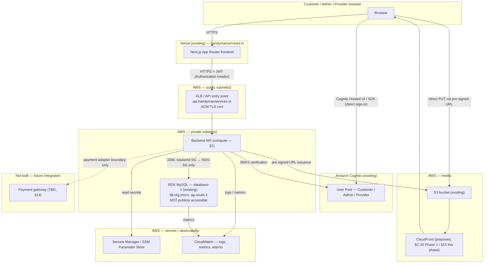
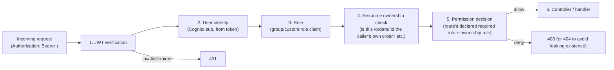

# Phase 2 — Backend System Architecture
## Handyman Services Marketplace

**Status:** Design only. Nothing in this document, or in any Phase 2 document, has been implemented, deployed, or used to modify AWS resources or the existing frontend. This document and its companions are the complete Phase 2 deliverable; Phase 3 (implementation) does not begin until the client explicitly approves the checklist at the end of this document.

**Builds on:** `PHASE_1_BACKEND_REQUIREMENTS_ANALYSIS.md` (approved baseline — not silently reinterpreted here), `PHASE_2_DATA_ARCHITECTURE.md`, `PHASE_2_API_CONTRACT.md` (the existing frontend-facing mock contract), `PHASE_2_OPEN_QUESTIONS.md`, and the actual current codebase (`src/types/index.ts`, `src/lib/data/*`, `src/lib/state/CartProvider.tsx`, `src/lib/pricing.ts`, `src/app/*`).

**Companion documents:** `PHASE_2_BACKEND_DATABASE_SCHEMA.md`, `PHASE_2_BACKEND_API_CONTRACT.md`, `PHASE_2_AWS_ARCHITECTURE.md`, `PHASE_2_AUTHORIZATION_MATRIX.md`, `PHASE_2_BACKEND_OPEN_QUESTIONS.md`, `PHASE_2_IMPLEMENTATION_PLAN.md`.

**Legend used throughout every Phase 2 document:** `CONFIRMED` (a client-stated requirement, not reinterpreted) · `RECOMMENDED` (this document's own proposal, requiring sign-off) · `TBD / CLIENT CONFIRMATION REQUIRED` (an open business rule, not assumed).

---

## 1. Final system architecture



**Reading the diagram:** the frontend never talks to RDS, S3 credentials, or Cognito's admin APIs — it talks to the backend API (for everything business-related) and to Cognito directly only for the sign-in/sign-up flow itself, which is Cognito's intended integration pattern (the browser gets a JWT back from Cognito and then presents that JWT to the backend API on every subsequent request). The backend is the only thing that ever reaches RDS, and only from inside the private subnet, only on port 3306, only from the backend's own security group. Media uploads go directly from the browser to S3 using a pre-signed URL the backend issues — large files never transit the backend server. This is a direct, unmodified continuation of the architecture already laid out in `PHASE_1_BACKEND_REQUIREMENTS_ANALYSIS.md` §C.38, now carried down to compute/network/security-group specificity in the companion documents.

**Network/security boundary summary** (detail in `PHASE_2_AWS_ARCHITECTURE.md`):

| Boundary | Public | Private |
|---|---|---|
| Reachable from the internet | ALB (HTTPS only), Cognito (AWS-managed, its own public endpoint), S3/CloudFront (media only) | — |
| Reachable only from inside the VPC | — | Backend API compute, RDS |

**DNS/TLS** (detail in `PHASE_2_AWS_ARCHITECTURE.md` §23): `handymanservices.in` stays on Vercel, unchanged. A new `api.handymanservices.in` record points at the AWS entry point, terminated in TLS via an ACM certificate.

**Monitoring/secrets** (detail in this document §21 and `PHASE_2_AWS_ARCHITECTURE.md` §20): CloudWatch for logs/metrics/alarms; Secrets Manager/Parameter Store for every credential the backend needs, never shipped to the frontend.

---

## 2. Backend compute decision — RESOLVED / APPROVED

**Final client decision: AWS ECS Fargate + Application Load Balancer.** Phase 1 recommended ECS Fargate without finalizing it; this choice is now approved, not merely recommended. Deployment path: ECR → ECS Fargate → ALB → RDS. This section's comparison table is retained below for historical traceability of why this option was chosen over Lambda/EC2. No compute resource has been created by this documentation-reconciliation pass — actual AWS resource creation remains a separate, not-yet-authorized step.

| Criterion | A. ECS Fargate + ALB | B. Lambda + API Gateway | C. EC2 |
|---|---|---|---|
| **Cost at low/pre-launch traffic** | Always-on cost (reserved vCPU/memory) even near-idle — the least cost-efficient of the three at zero traffic | Scales to near-zero cost when idle — best fit for an unpredictable, pre-launch traffic curve | Always-on cost, plus the operator pays for patching time even at zero traffic |
| **Operational complexity** | Moderate — container build/push (ECR), task definition, service, ALB target group; no OS patching | Low infra surface, but VPC-attached Lambda adds ENI/cold-start complexity that a plain persistent API doesn't have | Highest — OS patching, security updates, process supervision, scaling all manual or self-built |
| **Scalability** | Horizontal auto-scaling on the ECS service, well-understood, predictable | Scales automatically and very elastically, but each function invocation is short-lived by design | Requires manually building an Auto Scaling Group; more moving parts to get equivalent elasticity |
| **MySQL connectivity / connection management** | A small number of long-lived containers hold a normal connection pool (e.g. 5–20 connections per task) — straightforward, matches how most Node ORMs/connection pools are designed to behave | High-concurrency Lambda invocations can each open a new MySQL connection; on `db.t4g.micro`'s modest `max_connections`, this can exhaust the limit under a burst unless RDS Proxy (an extra resource/cost) is added | Same connection-pool story as Fargate, but the operator also owns keeping the pooling process alive across restarts |
| **Deployment** | Standard container CI/CD (build image → push to ECR → update service) — a well-trodden path for a REST API | Deploy is simple per-function, but a REST-API-shaped backend (many routes, one shared DB layer) is a less natural fit for Lambda's per-function model than for a microservice split it doesn't have yet | Requires building the deployment pipeline (SSH/CodeDeploy/AMI baking) from scratch |
| **Logging** | Native CloudWatch Logs integration via the ECS/Fargate log driver | Native CloudWatch Logs integration, per-invocation | Requires installing/configuring the CloudWatch agent |
| **Security** | Runs inside the same VPC/private subnet as RDS by default, least additional surface; container image is the only thing to keep patched | Also VPC-capable, same RDS-private-subnet story, but the platform (not the operator) patches the underlying runtime | Operator is responsible for OS-level hardening and patching — the largest ongoing security burden of the three |
| **Suitability for this project today** | A single, persistent, moderately-trafficked REST API with a relational database and no confirmed need for extreme scale-to-zero — Fargate is a close match | Would be the better choice if traffic is expected to be extremely spiky/low-volume for a long time, or if a serverless-first stack is a project preference (not stated by the client) | No confirmed requirement justifies EC2's added operational burden over a managed option |
| **Suitability for current AWS footprint/credits** | Fits cleanly alongside the existing VPC-adjacent RDS instance with no additional managed-connection-pooling resource required | Workable, but the RDS-connection caveat above likely means adding RDS Proxy later, which is an additional resource/cost not otherwise needed | Explicitly excluded from this phase's resource-creation scope regardless |
| **Future growth** | Scales by adjusting task count/size; a natural next step if traffic grows is adding read replicas (§ DB doc) behind the same compute layer, no re-architecture needed | Scales automatically, but growth into a "real" persistent API server (WebSockets, long-running jobs, heavier per-request DB work) tends to outgrow the pure-Lambda model over time | Scaling requires manual infrastructure work at every stage |

**Decision (RESOLVED / APPROVED by the client):** **ECS Fargate behind an Application Load Balancer**, deployed in the same VPC as RDS, backend compute in private subnets, ALB in public subnets. This fits the project's actual shape — one persistent REST API, one relational database, moderate and not yet spiky traffic, no confirmed serverless-first preference — better than Lambda's per-invocation model (which would otherwise need RDS Proxy added just to manage MySQL connections safely), and far better than EC2's manual operational burden, which nothing about this project's requirements justifies. This approval does **not by itself** create the ECS cluster, task definition, or ALB — actual AWS resource creation is a separate deployment step, not yet executed, and explicitly out of scope for both Phase 3 and this documentation reconciliation.

---

## 3–15. AWS network, S3, secrets, DNS, and resource-plan detail

Full designs for the AWS network architecture (VPC/subnets/security groups), S3 architecture, secrets/environment variables, DNS/TLS, and the consolidated AWS resource plan are in **`PHASE_2_AWS_ARCHITECTURE.md`**, to keep infrastructure concerns in one document rather than duplicated across two.

Full database design (§6–14: schema, columns, ERD, listing-approval state machine, pricing/snapshot architecture, city-availability, cart, order, and payment-abstraction architecture) is in **`PHASE_2_BACKEND_DATABASE_SCHEMA.md`**.

Full REST API contract (§16) is in **`PHASE_2_BACKEND_API_CONTRACT.md`**.

Full Cognito architecture and role/permission matrix (§4–5) are in **`PHASE_2_AUTHORIZATION_MATRIX.md`**.

---

## 17. Authorization middleware



**1. JWT verification.** Every protected request must carry a Cognito-issued JWT (access token, or ID token where user attributes are needed) in the `Authorization: Bearer <token>` header. The backend verifies the token's signature against Cognito's public **JWKS** (JSON Web Key Set, fetched from `https://cognito-idp.<region>.amazonaws.com/<userPoolId>/.well-known/jwks.json` and cached — never re-fetched per request), checks the `iss` (issuer) claim matches the expected user pool, checks the `aud`/`client_id` claim matches the app client used for that entry point (Customer vs. Admin/Provider — see `PHASE_2_AUTHORIZATION_MATRIX.md` §4), and checks `exp` (expiry) has not passed. An invalid signature, wrong issuer/audience, or expired token is rejected with `401` before any business logic runs.

**2. User identity.** The token's `sub` claim (Cognito's stable user identifier) is the backend's canonical identity key — it is what `customers.cognito_sub` / `service_providers.cognito_sub` are matched against (§ Database Schema doc). The backend never trusts a user-supplied ID in the request body for "who am I" purposes — only the verified token's `sub`.

**3. Role.** The role/group claim embedded in the token (§4, Authorization Matrix doc) determines which of Customer/Admin/Provider the caller is. This is read from the token, not looked up separately, since Cognito already embeds group membership in the token at issuance.

**4. Resource ownership.** For any endpoint scoped to "my own X" (a Customer's own orders/addresses, a Provider's own listings), the middleware (or the controller immediately after it) must check the resource's owning `customer_id`/`created_by_user_id` against the verified identity from step 2 — a valid, correctly-authenticated Provider token must never be sufficient by itself to read or modify another Provider's listing.

**5. Permission decision.** Each route declares its required role(s) and whether an ownership check applies; the middleware enforces this declaratively (e.g. a route-level decorator/config: `{ role: "admin" }`, `{ role: "provider", ownership: "own-listing" }`, `{ role: "customer", ownership: "own-resource" }`, or `{ public: true }`). A request that fails the role or ownership check is rejected with `403` (or, for an ownership failure where even the resource's existence shouldn't be confirmed to a non-owner, `404` is an acceptable alternative — a Phase 3 implementation detail, not decided here).

**Hard rule, restated from Phase 1 and binding here:** the frontend's own role-aware UI (showing/hiding an "Approve" button, etc.) is a UX convenience only. It is never a substitute for the server-side check above, and no endpoint may assume a request is legitimate because "the frontend wouldn't have shown that button to this user."

---

## 18. Error standard

Every backend API response (success or failure) uses one consistent envelope:

**Success:**
```json
{ "success": true, "data": { /* endpoint-specific payload */ }, "meta": { /* pagination, etc., when applicable */ } }
```

**Error:**
```json
{
  "success": false,
  "error": {
    "code": "VALIDATION_ERROR",
    "message": "A human-readable, customer/admin-appropriate message.",
    "details": { /* optional — e.g. per-field validation errors */ }
  }
}
```

| Category | HTTP status | Example `code` | Notes |
|---|---|---|---|
| Validation error | 400 | `VALIDATION_ERROR` | `details` may list per-field messages; never echoes back a raw ORM/DB error |
| Authentication error | 401 | `UNAUTHENTICATED` | Missing/invalid/expired JWT |
| Authorization error | 403 | `FORBIDDEN` | Valid identity, insufficient role or failed ownership check |
| Not found | 404 | `NOT_FOUND` | Also used instead of 403 where confirming existence to a non-owner would itself leak information (§17) |
| Conflict | 409 | `CONFLICT` | e.g. attempting to approve an already-approved listing, duplicate unique constraint |
| Rate limit | 429 | `RATE_LIMITED` | See §19 |
| Internal server error | 500 | `INTERNAL_ERROR` | Message is a generic, safe string; the real error is logged server-side (§21) with a request ID, never returned to the client |

**Hard rule:** no response body may ever include a raw database error message, a stack trace, a SQL fragment, an internal file path, or a secret value — regardless of environment. A correlating **request ID** (also emitted in the CloudWatch log line, §21) is returned in every error response so a client-reported issue can be traced server-side without exposing internals.

---

## 19. Validation & security

| Concern | Approach |
|---|---|
| **Input validation** | Schema-based validation (e.g. a JSON-schema or equivalent TypeScript-first validator) at the API boundary, before any handler logic runs — reject malformed/unexpected fields rather than silently ignoring them. |
| **SQL injection** | All database access goes through parameterized queries / an ORM's query builder — no string-concatenated SQL, anywhere, including admin-only endpoints. |
| **XSS** | The backend is a JSON API, not a template renderer — it does not need to HTML-escape output itself, but must not blindly trust and re-serve unsanitized rich-text fields (e.g. a future FAQ/testimonial body) without the frontend's own escaping; flagged for Phase 3 implementation review, not a new architectural decision here. |
| **CSRF** | Low risk for a token-bearer JSON API (no ambient cookie-based session to forge), as long as authentication stays JWT-in-header rather than a cookie-based session; if a cookie-based refresh-token pattern is later chosen (Phase 3 detail), CSRF protection must be revisited at that time. |
| **CORS** | Backend allow-lists only the known frontend origin(s) — production `https://handymanservices.in`, plus whichever staging/preview origins are confirmed in §24 — never a wildcard `*`, since the API accepts authenticated, credentialed requests. |
| **Rate limiting** | Recommended at the ALB/API-gateway layer and/or in-application (e.g. per-IP and per-authenticated-user limits on write endpoints and on the Cognito-adjacent "who am I" endpoint) — exact thresholds are a Phase 3 tuning detail, not fixed here. |
| **File upload validation** | Enforced both client-request-side (declared MIME type + size before a pre-signed URL is issued, §15) and, where feasible, by S3 bucket policy (content-type condition on the pre-signed POST/PUT) — never trust a client-declared MIME type alone for anything security-sensitive. |
| **MIME / file size limits** | Only image/video MIME types relevant to service media are accepted (exact allow-list, e.g. `image/jpeg`, `image/png`, `image/webp`, `video/mp4`, is a Phase 3 detail); a maximum file size is enforced before issuing the pre-signed URL. |
| **Authorization** | Server-side only, per §17 — never trusted from the frontend. |
| **Secret management** | Per `PHASE_2_AWS_ARCHITECTURE.md` §20 — Secrets Manager/Parameter Store, least-privilege IAM. |
| **Audit logging** | Admin actions with real consequence (approve/reject a listing, change a price, deactivate a service) should be logged with who/when/what-changed — a Phase 3 implementation detail (likely an `audit_log` table or structured CloudWatch log), not designed to the column level here since it isn't in the client's confirmed scope yet; flagged as `RECOMMENDED`, not `CONFIRMED`. |
| **Password handling** | Entirely Cognito's responsibility — the backend never receives, stores, or hashes a password itself. |
| **PII protection** | Customer/Provider PII (name, phone, email, address) stays in RDS (private, never public) and is never logged in plaintext in CloudWatch (log the customer/order ID, not the raw address/phone, in application logs). |
| **Payment webhook verification** | Not designed in detail — gateway is TBD (§14) — but the architectural rule is fixed now: any future payment webhook endpoint must verify the provider's signature before trusting the payload, and must be idempotent (§14). |
| **Idempotency** | Write endpoints with real-world consequence (`createOrder`, a future payment webhook) should accept an idempotency key or be designed so a client retry cannot create a duplicate order/charge — detailed further in the Database Schema doc's Order/Payment sections. |

Per the brief's own instruction, this list intentionally does not over-engineer protections (e.g. a WAF, bot-detection, elaborate anomaly detection) that nothing in the confirmed scope currently justifies — those remain options to revisit if/when real traffic or a specific threat is identified.

---

## 20. Secrets & environment variables

See `PHASE_2_AWS_ARCHITECTURE.md` §20 for the full table (unchanged from `PHASE_1_BACKEND_REQUIREMENTS_ANALYSIS.md` §C.30, carried forward here for the network/secrets document rather than duplicated).

---

## 21. Logging & monitoring

**Application logs (CloudWatch Logs):** structured JSON, one line per request, including at minimum: timestamp, request ID, route, method, caller role (if authenticated), response status, latency, and — on error — the error `code` from §18 (never the raw exception details in a log line reachable by anyone without infrastructure access; the raw exception is fine in the log itself, which is access-controlled, but the API response is not).

**Specifically tracked events:**
- API errors (4xx/5xx), with request ID for correlation back to a user-reported issue.
- Latency per route/percentile, to catch a slow endpoint before it's a customer complaint.
- Authentication failures (401s) — a spike here is a signal worth alerting on.
- Authorization failures (403s) — a spike on one route/user is worth investigating (could be a bug, could be a probing attempt).
- RDS: CPU utilization, active connections (relative to `db.t4g.micro`'s connection ceiling — relevant given §2's connection-pooling discussion), free storage, and — because the instance is `t4g` (burstable) — **CPU credit balance**, so a sustained-load throttling event is visible before it causes a customer-facing slowdown (this directly follows Phase 1's own suitability caveat about the current instance class).
- Backend compute health (ECS service task count/health, per §2's recommendation).

**Not built in this phase:** CloudWatch dashboards and alarms are designed conceptually above but **not created** — per the brief's explicit "do not create dashboards or alarms yet," this is a Phase 3 setup task once compute exists to monitor.

---

## 22. Backups & recovery

- **RDS automated backups**: recommended enabled with a retention window (7–14 days is a reasonable starting default — `RECOMMENDED`, not client-confirmed) before real customer/order data exists in the instance. This is a **configuration change to the existing RDS instance** and is explicitly **not made in this phase** — it is listed here as a Phase 3 prerequisite, consistent with Phase 1's "do not modify the existing RDS configuration."
- **Snapshot strategy**: a manual snapshot immediately before any schema migration in Phase 3, in addition to the automated daily backups, so a migration can be rolled back without relying solely on the rolling backup window.
- **Restore testing**: recommended as a Phase 3/operational practice (periodically restoring a snapshot to a scratch instance to confirm backups are actually restorable) — not performed in this design phase, since it requires an actual restore action against AWS.
- **S3 durability/versioning**: S3 itself is durable by design (11 nines); **versioning** on the media bucket is recommended (`RECOMMENDED`) so an accidental overwrite/delete of a service image is recoverable, at a small additional storage cost for retained old versions — this is a bucket **configuration** change, not a new resource, and is explicitly **not made in this phase** (the instruction is "do not modify the current S3 bucket").

---

## 23. DNS & TLS

See `PHASE_2_AWS_ARCHITECTURE.md` §23.

---

## 24. Development / staging / production

| Concern | Development | Staging | Production |
|---|---|---|---|
| **Cognito** | Separate app client within the existing single User Pool (§4, Authorization Matrix doc) — not a separate pool | Separate app client, same pool | Existing/production app clients |
| **Database** | `RECOMMENDED`: a separate, smaller RDS instance, or at minimum a separate schema/database name within a non-production instance — never the production `database-1` instance for dev work | Same treatment as dev, or a dedicated staging instance if budget allows | The existing `database-1` (resized per the scaling path in Phase 1 §C.21 if/when needed) |
| **S3** | A separate prefix (`dev/`) within the existing bucket, or a separate bucket if cost/isolation preference favors it | `staging/` prefix | `prod/` prefix (or the bucket's un-prefixed root, whichever convention Phase 3 settles on) |
| **Secrets** | Environment-specific entries in Secrets Manager/Parameter Store — a dev DB password must never be the same value as production's | Same, environment-scoped | Same, environment-scoped |
| **API URLs** | `NEXT_PUBLIC_API_BASE_URL` points at a dev backend endpoint | Points at a staging backend endpoint | Points at `api.handymanservices.in` |
| **Vercel environments** | Vercel's own Preview deployments (per-branch/PR) would call the dev or staging backend, per whatever Phase 3 decides is the default for Preview builds | Vercel Production environment variable set points at staging during pre-release testing, if that pattern is used | Vercel Production environment variables point at the production backend |
| **CORS** | Dev backend allow-lists `localhost` and any dev frontend origin | Staging backend allow-lists Vercel Preview origins (or a fixed staging frontend URL) | Production backend allow-lists only `https://handymanservices.in` (and `https://www.handymanservices.in` if used) |

**Not created in this phase**: no dev/staging AWS resources, Cognito app clients, or S3 prefixes are created here — this section documents the target strategy for Phase 3 to implement.

---

## 25. Migration strategy — mock DAL → real API DAL → backend

The existing frontend already enforces the exact boundary that makes this migration a mechanical, low-risk swap rather than a UI rewrite: **no component reads business data directly — every read/write goes through `src/lib/data/*.ts`** (`PHASE_2_API_CONTRACT.md` §1, re-confirmed by reading the actual code in this phase). Phase 3 changes only the *implementation* of each function in that layer — same name, same parameters, same return shape — from a mock-JSON/localStorage body to a real `fetch()` call against the backend API defined in `PHASE_2_BACKEND_API_CONTRACT.md`. No page or component changes.

| Existing mock DAL function (today) | Backend endpoint it becomes a thin `fetch()` wrapper around (Phase 3) |
|---|---|
| `getCities()`, `getCityBySlug()`, `getPopularCities()` | `GET /api/v1/cities`, `GET /api/v1/cities/:slug` |
| `getCategories()`, `getCategoryBySlug()` | `GET /api/v1/categories`, `GET /api/v1/categories/:slug` |
| `getProductsByCategory()`, `getProductBySlug()` | `GET /api/v1/categories/:categorySlug/products`, `GET /api/v1/categories/:categorySlug/products/:productSlug` |
| `getServiceTypes()` | `GET /api/v1/service-types` |
| `getServicesByProduct()`, `getServiceBySlug()`, `getFeaturedServices()`, `getMostBookedServices()`, `getServicesByCategory()` | `GET /api/v1/services?productId=...&cityId=...`, `GET /api/v1/services/:slug`, `GET /api/v1/services?featured=true`, `GET /api/v1/services?mostBooked=true`, `GET /api/v1/services?categoryId=...` |
| `getOffers()` | `GET /api/v1/offers` |
| `searchCatalog()` | `GET /api/v1/search` |
| `getCart()` / `addToCart()` / `updateCartItemQuantity()` / `removeFromCart()` / `clearCart()` (today: pure `CartProvider` local state, not the DAL) | **Conditional** on the cart architecture decision (`PHASE_2_BACKEND_DATABASE_SCHEMA.md` §12) — if server-persisted carts are confirmed, these become `GET/POST/PATCH/DELETE /api/v1/cart...`; if the guest-cart-stays-local design is kept, `CartProvider` continues to own this state client-side and only syncs to the backend at checkout |
| `createOrder()` | `POST /api/v1/orders` |
| `getOrderById()` | `GET /api/v1/orders/:id` |
| *(not yet built)* `getCurrentCustomer()`, `login()`, `logout()` — reserved signatures only, per `PHASE_2_API_CONTRACT.md` §6 | Sign-in/sign-up itself is handled by Cognito directly from the frontend (§4, Authorization Matrix doc); `getCurrentCustomer()` becomes `GET /api/v1/me` |
| *(not yet built)* Admin-facing writes reserved in `PHASE_2_API_CONTRACT.md` §7 | `POST/PATCH /api/v1/admin/...` per `PHASE_2_BACKEND_API_CONTRACT.md` |

The frontend's UI remains the presentation layer throughout; the backend becomes the source of truth the moment each function's implementation is swapped. Because every function is already `async` (a deliberate Phase 2-era decision made exactly for this reason, per `PHASE_2_API_CONTRACT.md` §1), swapping a mock body for a real `fetch()` call is not even a signature change for the read functions — only the cart functions (today deliberately synchronous, since cart is genuine client state) would change signature **if and only if** server-persisted cart is confirmed; this is flagged, not hidden, since it's the one place this migration isn't purely an implementation swap.

---

## 26. AWS resource plan

See `PHASE_2_AWS_ARCHITECTURE.md` §26 for the full table.

---

## 27. Phase 3 implementation plan (summary)

Full detail in **`PHASE_2_IMPLEMENTATION_PLAN.md`**. Summary sequence:

1. Backend project bootstrap
2. Database migration system
3. Database schema (per `PHASE_2_BACKEND_DATABASE_SCHEMA.md`)
4. Cognito integration
5. Authorization middleware (§17)
6. Catalog APIs (public reads)
7. Provider APIs (listing create/edit/submit)
8. Admin approval APIs
9. S3 upload APIs
10. Cart APIs (pending the cart-architecture confirmation, §12 of the Database doc)
11. Order APIs
12. Payment abstraction (boundary only — no real gateway, per §14)
13. Validation (§19)
14. Logging (§21)
15. Tests
16. Deployment preparation (AWS resource creation per §26, DNS cutover per §23)

This sequence is **not executed in this phase.**

---

## PHASE 2 APPROVAL CHECKLIST

```
[ ] Backend architecture approved
[x] Compute choice approved — RESOLVED: ECS Fargate + ALB (see §2)
[ ] Database schema approved
[ ] ERD approved
[ ] Cognito architecture approved
[ ] Role/permission matrix approved
[ ] Provider approval workflow approved
[ ] Pricing architecture approved
[ ] Cart architecture approved
[ ] Order architecture approved
[ ] Payment abstraction approved
[ ] S3 architecture approved
[ ] API contract approved
[ ] Security architecture approved
[ ] AWS network architecture approved
[ ] DNS architecture approved
[ ] Environment strategy approved
[ ] Phase 3 implementation plan approved
```

**Remaining `TBD / CLIENT CONFIRMATION REQUIRED` items:** the complete, consolidated list is in `PHASE_2_BACKEND_OPEN_QUESTIONS.md` — not duplicated here to avoid two copies of the same list drifting apart.

---

**Stop rule.** This document and its six companions are the complete Phase 2 deliverable. No backend code, database table, migration, AWS resource, Cognito/RDS/S3 modification, DNS change, or frontend change has been made. Work stops pending the client's review of the checklist above and the confirmations listed in `PHASE_2_BACKEND_OPEN_QUESTIONS.md`.
